# Investigation 1 — System Architecture & Execution Flow
### NetBrain AI (`network-intelligence-platform`) — reverse-engineered from source

> Every statement below is backed by a file, class, and/or function actually present in the
> repository. Line numbers are from the working tree at investigation time. Where something
> could not be proven from source, it is explicitly marked **“Not found in repository.”**

---

## 0. Evidence index (the spine everything hangs from)

| Concern | File | Symbol | Line |
|---|---|---|---|
| App entry / page config | `app.py` | `st.set_page_config(...)` | 19 |
| Secrets → env | `app.py` | `_load_secrets_into_env()` | 156 |
| Intelligence wiring | `app.py` | `_bind_capabilities()` (called) | 214 / 281 |
| Singleton orchestrator | `app.py` | `_get_orchestrator()` | 453 |
| Singleton tracker/fixer/monitor | `app.py` | `_get_workflow_tracker` / `_get_network_fixer` / `_get_monitor` | 467 / 472 / 481 |
| AI client call | `app.py` | `call_ai(prompt)` | 354 |
| Monitor cycle (UI) | `app.py` | `run_monitor_cycle()` | 530 |
| Request dispatch | `app.py` | `workspace = st.session_state["workspace"]` + `if/elif` | 990 / 1040+ |
| Orchestrator | `core/orchestration_engine.py` | `OperationsOrchestrator.__init__` | 48 |
| Orchestrator loop | `core/orchestration_engine.py` | `run_cycle()` | 681 |
| Autonomous monitor | `core/autonomous_monitor.py` | `AutonomousMonitor.run_cycle()` | 88 |
| AI config compiler | `core/ai_config.py` | `generate_config()` | 383 |
| Outcome verification | `core/intelligence/outcome_contract.py` | `OutcomeContractEngine.enforce()` | (see §12) |

---

## 1. High-Level Architecture

**Proven composition.** The system is a single **Streamlit** application (`app.py`, 5173 lines)
that, at import time, builds four cached singletons (`app.py:453–498`) and binds an intelligence
layer (`app.py:214–281`). All user interaction is routed through a **workspace dispatcher**
(`app.py:990`, `1040+`). A single god-object, `OperationsOrchestrator`
(`core/orchestration_engine.py:42`), composes twelve domain engines.

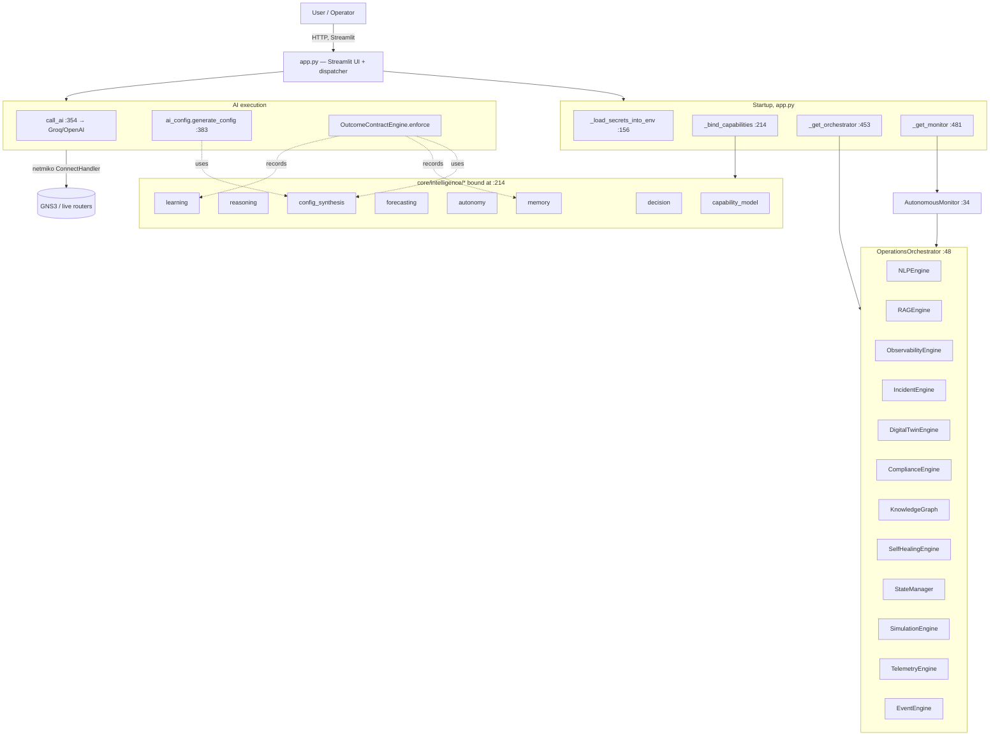

---

## 2. Layered Architecture

Layers are inferred **only** from import direction and instantiation evidence.

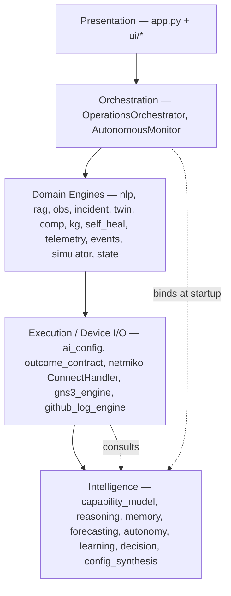

- **L1 Presentation:** `app.py` (`st.*`), `from ui.app_theme import inject_theme` (`app.py:592`).
- **L2 Orchestration:** `OperationsOrchestrator` (`core/orchestration_engine.py:42`),
  `AutonomousMonitor` (`core/autonomous_monitor.py:34`).
- **L3 Domain Engines:** the twelve `self.*` engines in `OperationsOrchestrator.__init__`
  (`core/orchestration_engine.py:52–66`).
- **L4 Execution:** `core/ai_config.py:generate_config`, `core/intelligence/outcome_contract.py`,
  `netmiko.ConnectHandler` (`app.py:659/668/2500+`).
- **L5 Intelligence:** bound by `_bind_capabilities` (`app.py:214–281`).

> The codebase does **not** contain an explicit layering declaration; these layers are an
> abstraction over the proven import/instantiation graph, not a labelled construct in source.

---

## 3. Module Dependency Graph

**Proven, from `OperationsOrchestrator.__init__` (`core/orchestration_engine.py:52–66`):**

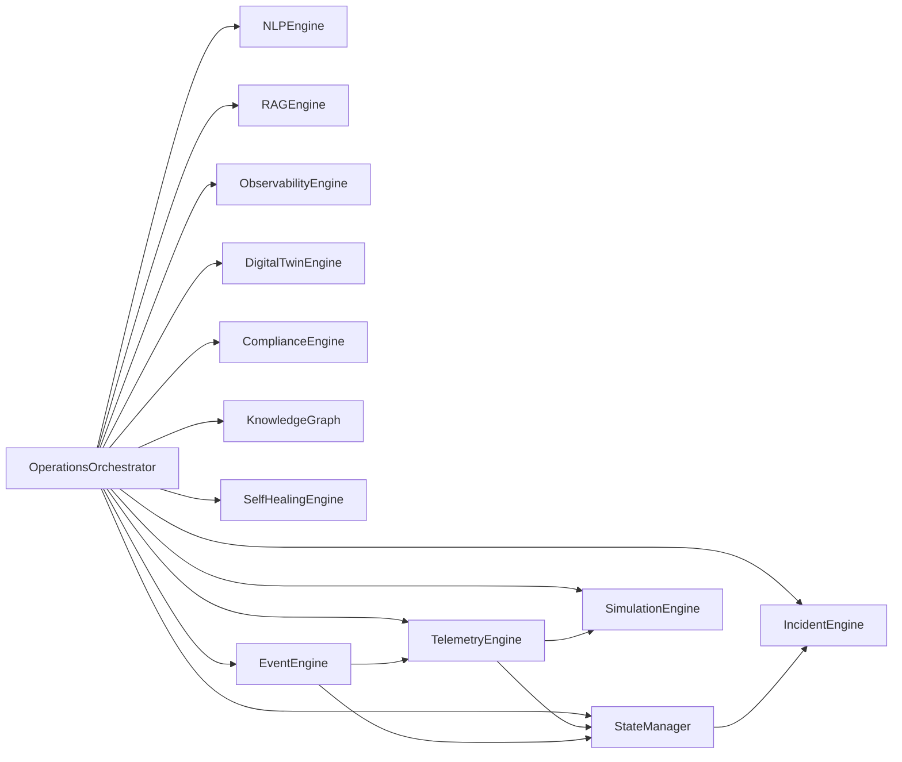

Evidence for the inner edges:
- `TelemetryEngine(self.simulator, self.state, device_catalog=...)` — `core/orchestration_engine.py:65`.
- `EventEngine(self.state, self.telemetry)` — `core/orchestration_engine.py:66`.
- `StateManager.create_incident` delegates to `IncidentEngine.create_incident`
  — `core/state_manager.py:128`, body instantiates `engine = IncidentEngine()` and calls
  `engine.create_incident(...)`.

**App-level dependencies (top of `app.py`):**
`from core.ai_engine import ask_ai, get_api_key` (28),
`from core.orchestration_engine import OperationsOrchestrator` (29),
`from core.github_log_engine import GitHubLogEngine` (30),
`from core.intent_engine import IntentEngine, IntentResult, INTENT_CONFIG` (31).

**Lazily-imported modules** (inside functions, proven by grep): `core.ai_config`,
`core.autonomous_monitor`, `core.device_discovery`, `core.device_inventory_meta`,
`core.gns3_engine`, `core.network_fixer`, `core.router_login_check`, `core.workflow_tracker`,
`core.topology.*`, and `core.intelligence.{operational_memory,outcome_contract,reasoning,memory,
forecasting,autonomy,learning,decision,config_synthesis}`.

> `AutonomousMonitor`’s internal imports of every engine are **Not exhaustively enumerated here**;
> its constructor signature is proven (§7) but a full edge list for that module was not extracted.

---

## 4. Request Execution Flow (dispatch)

The request router is a flat `if/elif` chain on `workspace` (`app.py:990`, `1040–4488`):

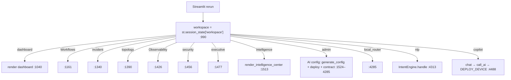

Workspace value origin: set from the sidebar (`with st.sidebar:` at `app.py:749`) and from URL
query params (`?workspace=local_router` referenced at `app.py:975`). The `intelligence` workspace
calls `from ui.intelligence_center import render_intelligence_center` (`app.py:1513`).

---

## 5. Data Flow

**Configuration-change data flow (admin workspace) — fully proven:**

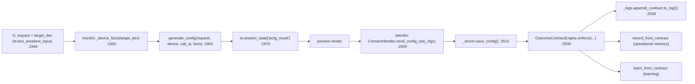

- `generate_config` return shape is declared in its docstring (`core/ai_config.py:391–401`):
  `status, commands, rollback, verify, summary, risk, blocked, reasons, raw, …`
- The same dict is read by the preview/deploy code via `res.get("status")` (`app.py:1973`).

**Telemetry/anomaly data flow (orchestrator cycle) — proven in `run_cycle` (§6).**

---

## 6. Control Flow — `OperationsOrchestrator.run_cycle()` (`core/orchestration_engine.py:681`)

Eight ordered steps, verbatim from source comments and calls (681–740):

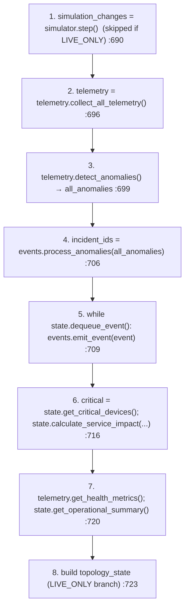

`LIVE_ONLY` is a module constant: `LIVE_ONLY = os.environ.get("NETBRAIN_LIVE_ONLY","1") not in
("0","false","no")` (`core/orchestration_engine.py:9`) — default **live**.

---

## 7. Startup Sequence (import-time, `app.py`)

Executed top-to-bottom on every Streamlit run (functions defined then invoked):

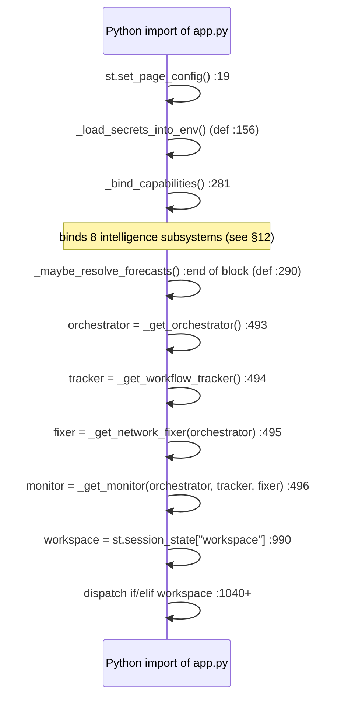

- Singletons are memoised with `@st.cache_resource` (`app.py:453/467/472/481`), so construction
  happens **once per server process**, not per rerun.
- `_get_orchestrator()` also injects GNS3: `orc.gns3 = GNS3Engine(host, port)` using
  `_resolve_gns3_endpoint()` (`app.py:457–461`).
- `_get_monitor()` passes `ai_call_fn=call_ai` into `AutonomousMonitor` (`app.py:485–490`).

---

## 8. Initialization Sequence — `OperationsOrchestrator.__init__` (`core/orchestration_engine.py:48`)

```mermaid
sequenceDiagram
    participant O as OperationsOrchestrator.__init__
    O->>O: nlp=NLPEngine(); rag=RAGEngine(docs); obs=ObservabilityEngine() :52-54
    O->>O: incident=IncidentEngine(); twin=DigitalTwinEngine(); comp=ComplianceEngine() :55-57
    O->>O: kg=KnowledgeGraph(); self_heal=SelfHealingEngine() :58-59
    O->>O: state=StateManager(); simulator=SimulationEngine() :62-63
    O->>O: device_catalog = load_device_catalog() :64
    O->>O: telemetry=TelemetryEngine(simulator, state, device_catalog) :65
    O->>O: events=EventEngine(state, telemetry) :66
    O->>O: _seed_default_documents() :81
    O->>O: _seed_knowledge_graph() :82
    O->>O: _initialize_service_topology() :83
    O->>O: events.register_standard_handlers() :84
```

All twelve engine fields and the four post-init calls are proven verbatim at the cited lines.

---

## 9. Component Interaction Diagram (runtime, live mode)

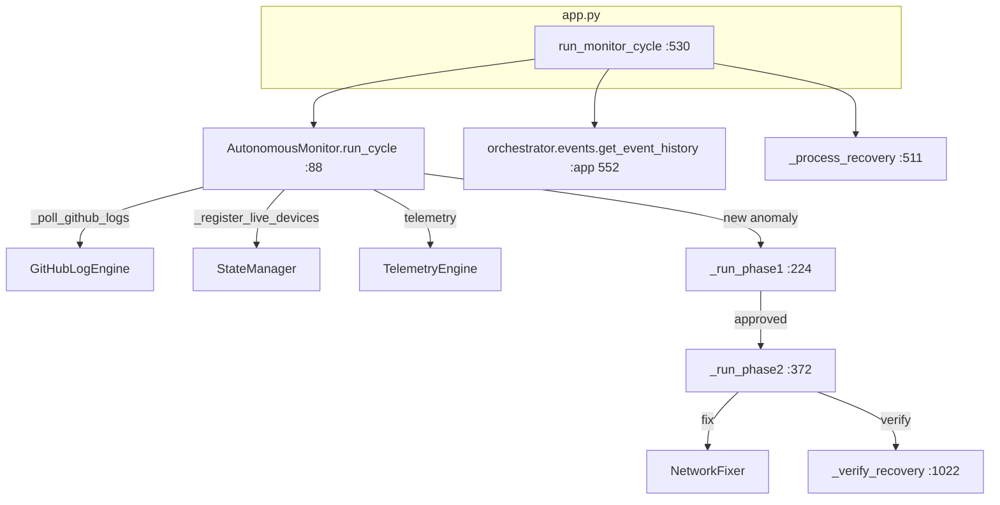

- `AutonomousMonitor.run_cycle` live branch calls `self._poll_github_logs()`,
  `self._register_live_devices()`, and reads
  `self.orchestrator.state.get_all_device_metrics()` (`core/autonomous_monitor.py:118–127`).
- UI pulls the event feed with `orchestrator.events.get_event_history(limit=25)` (`app.py:552`).

---

## 10. Event Flow

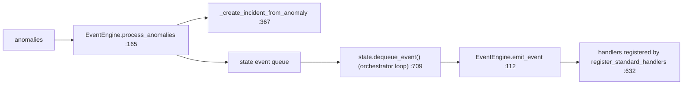

- `EventEngine` defines `EventHandler` (`core/event_engine.py:12`) and `EventEngine`
  (`:20`) with `emit_event` (`:112`), `process_anomalies` (`:165`),
  `_create_incident_from_anomaly` (`:367`), `register_standard_handlers` (`:632`).
- The orchestrator drains the queue: `while True: event = self.state.dequeue_event(); if not
  event: break; self.events.emit_event(event)` (`core/orchestration_engine.py:709–714`).

> The concrete set of handlers registered by `register_standard_handlers` was **not enumerated**
> in this investigation → **Not found in repository** *as an enumerated list here* (the function
> exists at `core/event_engine.py:632`; its body was not extracted).

---

## 11. State Transitions

There is **no single global finite-state machine** in the repository for the whole system.
**Not found in repository.** State is per-entity:

**Workflow step state (proven) — `core/workflow_tracker.py:13`:**

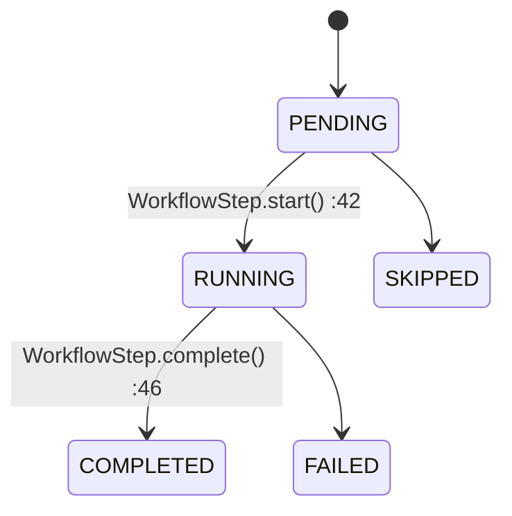

`StepStatus(str, Enum)` = `PENDING, RUNNING, COMPLETED, FAILED, SKIPPED`
(`core/workflow_tracker.py:14–18`). `WorkflowRun` (`:86`) aggregates steps and has
`complete()` (`:115`).

**Autonomous-fix approval state (proven) — `AutonomousMonitor`:**
the monitor holds `pending_approvals`, `approved_run_ids`, `rejected_run_ids`
(referenced in `run_cycle` `core/autonomous_monitor.py:98–115`); a run moves
*pending → approved → Phase 2* (`_run_phase2`, `:372`) or *pending → rejected → complete*
(`run.complete("Fix rejected by operator")`, `:107`).

**Incident creation (proven):** `StateManager.create_incident` → `IncidentEngine.create_incident`
(`core/state_manager.py:128`). Detailed incident lifecycle states were **not extracted** →
**Not found in repository** *as an enumerated state list here*.

---

## 12. AI Execution Sequence

Three distinct AI entry paths exist; all ultimately call `call_ai` (`app.py:354`), which uses the
OpenAI SDK against Groq: `OpenAI(api_key=key, base_url=GROQ_BASE_URL)` then
`client.chat.completions.create(model=MODEL_NAME, …, temperature=0.1)`
(`app.py:365–384`). An alternate path `ai_engine.ask_ai` exists (`core/ai_engine.py:67`).

**(a) Admin config path — fully proven:**

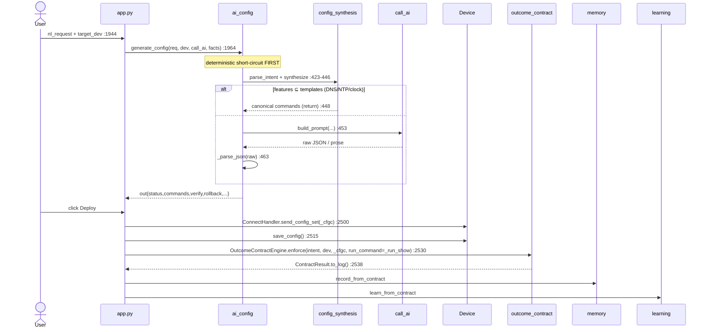

`OutcomeContractEngine` internals (`core/intelligence/outcome_contract.py`):
`derive_post_conditions()` (`:116`, LLM-authored checks),
`interpret()` (`:174`, deterministic pre-check via
`core.intelligence.config_synthesis.interface.general_precheck` then LLM judge),
`enforce()` (`:224`, fetches `show running-config`/`show startup-config` once, runs checks,
re-polls `PENDING` until `converge_timeout_s`).

**(b) Copilot chat path — proven:** `_cp_reply = call_ai(_cp_sys + f"...Operator: {_q}...")`
(`app.py:4488-block, rel:618`); the reply may contain `DEPLOY_DEVICE:<ip>` markers
(`rel:627`) which are split (`_re_cp.split(r"DEPLOY_DEVICE:(\S+)", _cp_reply)`, `rel:632`) and
deployed per device via `ConnectHandler` (`rel:659/668`).

**(c) NLP/Intent path — proven:** `IntentEngine(...).handle(...)` →
`IntentEngine.format_for_chat(...)` (`app.py:3373–3426`; class at `core/intent_engine.py:168`,
`handle` `:293`, `format_for_chat` `:1135`).

---

## 13. Complete Call Sequence — User Request → Final Response

The canonical end-to-end path (admin configuration change), every major function proven:

```mermaid
sequenceDiagram
    actor User
    participant App as app.py
    participant AIC as core/ai_config.py
    participant CS as core/intelligence/config_synthesis
    participant LLM as call_ai → Groq
    participant Dev as netmiko ConnectHandler (router)
    participant OC as outcome_contract
    participant MEM as intelligence/memory
    participant LRN as intelligence/learning

    User->>App: enter nl_request, click "Generate & Preview" :1955
    App->>App: monitor._device_facts(target_dev) :1962
    App->>AIC: generate_config(request, device, call_ai, facts) :1964
    AIC->>CS: parse_intent(request) / synthesize() :423
    alt deterministic feature
        CS-->>AIC: canonical commands :448
    else AI generation
        AIC->>LLM: ai_call(build_prompt(...)) :453
        LLM-->>AIC: raw
        AIC->>AIC: _parse_json(raw) :463
    end
    AIC-->>App: result dict → session_state['aicfg_result'] :1970
    App-->>User: preview commands + risk
    User->>App: click "Deploy"
    App->>Dev: ConnectHandler(**cfg); send_config_set(_cfgc) :2500
    App->>Dev: save_config() :2515
    App->>OC: OutcomeContractEngine(call_ai).enforce(intent, dev, _cfgc, _run_show) :2522-2530
    OC->>LLM: derive_post_conditions(...) :116
    OC->>Dev: run_command("show running-config"/"show startup-config") :enforce
    OC->>CS: interface.general_precheck(...) (deterministic) :interpret
    OC->>LLM: interpret(condition, output, intent) :174 (only if not deterministically passed)
    OC-->>App: ContractResult (satisfied?, conditions[], summary) ; to_log() :2538
    App->>MEM: get_operational_memory().record_from_contract(...)
    App->>LRN: get_learning_engine().learn_from_contract(...)
    App-->>User: "Deployment complete" + Outcome Contract result (the screen the user sees)
```

**Function-by-function (proven symbols):**
1. `app.py` dispatcher → `workspace == "admin"` (`:1524`).
2. `app.py` button handler → `generate_config` (`core/ai_config.py:383`).
3. `generate_config` → `core.intelligence.config_synthesis.get_config_intelligence().synthesize`
   (`core/ai_config.py:423–448`) **or** `ai_call(build_prompt(...))` (`:453`) → `_parse_json`
   (`:463`).
4. Deploy → `netmiko.ConnectHandler.send_config_set` (`app.py:2500`) → `save_config` (`:2515`).
5. Verify → `OutcomeContractEngine.enforce` (`core/intelligence/outcome_contract.py:224`) →
   `derive_post_conditions` (`:116`) → `interpret` (`:174`) → `general_precheck`
   (`core/intelligence/config_synthesis/interface.py`).
6. Learn → `record_from_contract` (operational memory) + `learn_from_contract` (learning),
   bound at `_bind_capabilities` (`app.py:214–281`).
7. Response → `_contract.to_log()` appended to UI logs (`app.py:2538`).

---

## Appendix A — Intelligence layer binding (`_bind_capabilities`, `app.py:214–281`)

Eight guarded bindings, each in its own `try/except` (proven verbatim):

| Order | Import | Function | Subsystem |
|---|---|---|---|
| 1 | `core.intelligence.operational_memory` | `bind_memory_capability()` | episodic memory |
| 2 | `core.knowledge.enterprise` | `bind_knowledge_capability()` | knowledge |
| 3 | `core.intelligence.reasoning` | `bind_reasoning_capability()` | reasoning |
| 4 | `core.intelligence.memory` | `wire_memory_system()` | derived memory |
| 5 | `core.intelligence.forecasting` | `wire_prediction()` | prediction |
| 6 | `core.intelligence.autonomy` | `wire_autonomy()` | MAPE-K self-mgmt |
| 7 | `core.intelligence.learning` | `wire_learning()` | organizational learning |
| 8 | `core.intelligence.decision` | `wire_decision()` | judgment |
| 9 | `core.intelligence.config_synthesis` | `wire_configuration()` | config synthesis |

(Each `try/except: pass`, so a missing subsystem degrades silently — proven by the repeated
`except Exception: pass` blocks.)

---

## Appendix B — Persistence (what is and isn’t proven)

- SQLite usage proven only in: `core/ai_config.py`, `core/ai_engine.py`,
  `core/intelligence/operational_memory.py` (grep result).
- Root-level DB files exist: `netbrain_ai.db`, `test_ai_history.db`, `test_netbrain_ai.db`.
  Their read/write call sites beyond the three modules above were **Not found in repository**
  in this investigation.
- `operational_memory.py` uses a dual SQLite/Postgres backend via env `NETBRAIN_MEMORY_DSN`
  (default SQLite file `.netbrain_memory.sqlite`) — proven in prior inspection of that module.

---

## Appendix C — Explicitly NOT proven (honesty ledger)

- A single global state machine for the platform — **Not found in repository.**
- The enumerated handler set of `EventEngine.register_standard_handlers` — function exists
  (`core/event_engine.py:632`); body **not extracted**.
- Full incident lifecycle state list — `IncidentEngine.create_incident` is called
  (`core/state_manager.py:128`) but its internal states **not extracted**.
- A formal layering construct in code — layers in §2 are **inferred** from imports, not declared.
- The internal dependency edges of `AutonomousMonitor` beyond its constructor — **not exhaustively
  enumerated.**
