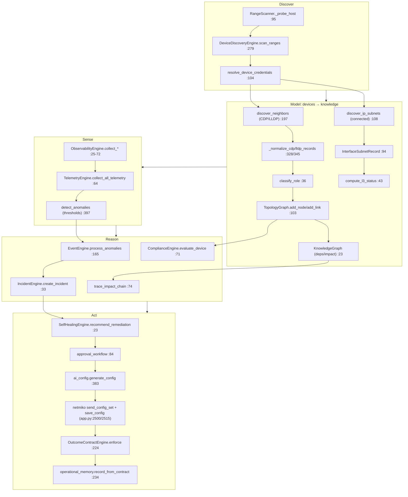

# Investigation 3 — Network Intelligence Architecture
### How NetBrain AI models, discovers, and reasons about networks — reverse-engineered from source

> Rules honored: repository evidence only; no inferred networking behavior; **no assumed vendors or
> protocols**; no invented topology. Every statement cites file / class / function / line.
> Unprovable items are marked **“Not found in repository.”**

---

## Evidence index

| Area | File | Symbol : line |
|---|---|---|
| Topology Discovery | `core/topology/topology_engine.py` | `build_topology_for_site` :33 |
| Layer-2 Discovery | `core/topology/discovery.py` | `discover_neighbors` :197 |
| Layer-3 Discovery | `core/topology/l3_discovery.py` | `discover_ip_subnets` :108 |
| L3 link status | `core/topology/l3_topology.py` | `compute_l3_status` :43 |
| Device Discovery | `core/device_discovery.py` | `DeviceDiscoveryEngine` :88 |
| Range scan | `core/discovery/range_scanner.py` | `RangeScanner` :110 |
| Inventory meta | `core/device_inventory_meta.py` | `detect_oem_and_type` :159 |
| Role Classification | `core/topology/role_classifier.py` | `classify_role` :36 |
| Interface model | `core/topology/topology_models.py` | `TopologyGraph` :103 |
| Interface naming | `core/topology/interface_naming.py` | `abbreviate_interface` :52 |
| Knowledge graph | `core/knowledge_graph.py` | `KnowledgeGraph` :23 |
| NLP (text) | `core/nlp_engine.py` | `NLPEngine` :67 |
| Compliance | `core/compliance_engine.py` | `ComplianceEngine` :16 |
| Telemetry | `core/telemetry_engine.py` | `TelemetryEngine` :24 |
| Observability | `core/observability_engine.py` | `ObservabilityEngine` :15 |
| Network State | `core/state_manager.py` | `StateManager` :106 |
| Incident | `core/incident_engine.py` | `IncidentEngine` :21 |
| Self-healing | `core/self_healing_engine.py` | `SelfHealingEngine` :20 |
| Network fixer | `core/network_fixer.py` | `NetworkFixer.fix` :162 |
| Simulation | `core/simulation_engine.py` | `SimulationEngine.step` :247 |

---

## 1. Topology Discovery

- **Purpose / Entry:** `build_topology_for_site(site_name, all_approved_devices, …) -> TopologyGraph`
  (`core/topology/topology_engine.py:33`). Returns a cached graph if present (`:30–38`).
- **Proven steps (from the function body):**
  1. Filter approved devices for the site (`:41`).
  2. Create `TopologyGraph(site_name, city, country, region)` (`:46`).
  3. Per device: `role = classify_role(...)` (`:53`) then `graph.add_node(TopologyNode(...))` (`:57`).
  4. Concurrent neighbor discovery: `ThreadPoolExecutor` submitting `discover_neighbors` per device
     (`:67`), collected into `results_by_ip` (`:65`), timeout 120s (`:68`).
- **Output:** a `TopologyGraph`. Unapproved neighbors are recorded but not added
  (`graph.unapproved_neighbors`, comment `:20`).
- **Site listing:** `list_available_sites(all_approved_devices)` (`:247`).

## 2. Layer-2 Discovery

- **Purpose / Entry:** `discover_neighbors(device) -> DiscoveryResult` (`core/topology/discovery.py:197`).
- **Protocols (literally proven):** **CDP and LLDP only.** The command table maps
  `"cdp" → "show cdp neighbors detail"` and `"lldp" → "show lldp neighbors detail"`
  (`discovery.py:49–54`). (Grep: CDP appears 36×, LLDP 30× in this file.)
- **Parsing:** TextFSM via ntc-templates first, regex fallback — proven in the module docstring
  (`:13–17`) and command table comment (`:43–45`). Helpers: `_parse_with_textfsm` (`:303`),
  `_parse_cdp_regex` (`:372`), `_parse_lldp_regex` (`:400`).
- **Normalization:** `_normalize_cdp_records` (`:328`), `_normalize_lldp_records` (`:345`) →
  `NeighborRecord` (`:98`).
- **Connection:** `_establish_connection(device, base_type, …)` (`:142`); `_base_platform` (`:124`).
- **Output:** `DiscoveryResult` (`:109`) carrying `NeighborRecord`s.
> No other L2 discovery protocol is referenced → **Not found in repository.**

## 3. Layer-3 Discovery

- **Purpose / Entry:** `discover_ip_subnets(device) -> L3DiscoveryResult`
  (`core/topology/l3_discovery.py:108`).
- **Mechanism (proven):** extracts **connected subnets** — `_extract_connected_subnets` (`:204`),
  `_parse_connected_regex` (`:254`), TextFSM path `_parse_with_textfsm` (`:182`) → records of type
  `InterfaceSubnetRecord` (`:94`), aggregated into `L3DiscoveryResult` (`:100`).
- **L3 link status:** `compute_l3_status(graph) -> Dict[int, L3LinkStatus]`
  (`core/topology/l3_topology.py:43`), `L3LinkStatus` (`:37`).
- **Output:** interface→subnet records; per-link L3 status.
> Routing-protocol L3 discovery (OSPF/EIGRP/IS-IS adjacencies) is **Not found in repository** —
> the L3 mechanism proven is connected-subnet extraction only.

## 4. Device Discovery

- **Purpose:** Find devices on the network and hold their state.
- **Location/Entry:** `DeviceDiscoveryEngine` (`core/device_discovery.py:88`); `scan_subnet(subnet_prefix
  ="192.168.0")` (`:266`); `scan_ranges(...)` (`:279`). Low-level port probe:
  `discovery/range_scanner.py` `RangeScanner` (`:110`), `_probe_host(ip, ports, timeout)` (`:95`),
  `get_range_scanner()` singleton (`:252`), `ScanProgress` (`:64`).
- **Dependencies:** `DiscoveredDevice` (`:42`), `TroubleshootSession` (`:69`),
  `DeviceLogStore` (`:957`), `_save_device_state` (`:1060`).
- **Output:** discovered devices + persisted device log state (`.netbrain_device_logs.json`,
  `DeviceLogStore.__init__` default path `:963`).

## 5. Inventory

- **Purpose:** Metadata + persistence of known devices.
- **Location:** `core/device_inventory_meta.py` (OEM/type metadata) and `DeviceLogStore`
  (`core/device_discovery.py:957`).
- **Entry/Exit:** `detect_oem_and_type(...)` (`:159`); `is_recognized_network_vendor(device_type)`
  (`:215`); `countries_for_region(region)` (`:50`).
- **Output:** vendor/OEM/type tuples; persisted device records.

## 6. Role Classification

- **Purpose / Entry:** `classify_role(vendor, device_type, platform_string, capabilities) -> DeviceRole`
  (`core/topology/role_classifier.py:36`).
- **Logic (proven, priority order in the body):**
  1. Inventory vendor/device_type → `FIREWALL` for `paloalto_panos, fortinet, cisco_asa,
     checkpoint_gaia` (`:51–55`).
  2. Platform-string hints (from CDP/LLDP) → FIREWALL / ACCESS_POINT / PHONE (`:59–66`).
  3. CDP/LLDP capability codes ("Router", "Switch", "Phone", …) (`:68+`).
  4. Fallback `UNKNOWN`.
- **Output:** `DeviceRole` enum = `ROUTER, SWITCH, ACCESS_POINT, FIREWALL, PHONE, UNKNOWN`
  (`core/topology/topology_models.py:19–24`), each with `icon` (`:28`), `color` (`:39`),
  `layer` (`:50`).

## 7. Interface Models

- **Purpose:** Typed model of nodes, links, and interfaces.
- **Location:** `core/topology/topology_models.py` — `TopologyNode` (`:63`, `label` `:84`),
  `TopologyLink` (`:89`, `edge_key` `:97`), `TopologyGraph` (`:103`, `add_node` `:115`).
- **Interface naming:** `abbreviate_interface(name)` (`core/topology/interface_naming.py:52`).
- **L3 interface record:** `InterfaceSubnetRecord` (`core/topology/l3_discovery.py:94`).
- **Output:** the in-memory graph model consumed by layout/plotly views
  (`core/topology/plotly_view.py`, imported in `app.py`).

## 8. Protocol Discovery (only what is literally referenced)

- **L2:** **CDP, LLDP** (`discovery.py:49–54`).
- **L3:** connected subnets (`l3_discovery.py:204/254`).
- **BGP:** `ObservabilityEngine.collect_bgp_state(peers)` (`core/observability_engine.py:72`) —
  collects BGP peer state (1 literal `BGP` reference found).
> **OSPF, EIGRP, IS-IS, HSRP, VRRP, STP discovery logic: Not found in repository** (0 occurrences
> in `discovery.py`, `l3_discovery.py`, `observability_engine.py`, `role_classifier.py`). Those
> tokens appear only inside LLM **prompt text** (e.g. `NETBRAIN_ENGINE_PREAMBLE`), not as discovery
> code.

## 9. Vendor Detection

- **Purpose / Entry:** `detect_oem_and_type(...)` (`core/device_inventory_meta.py:159`).
- **Mechanisms (proven):** banner signature match `match_oem_signature(banner_text)` (`:145`),
  raw banner grab `_grab_raw_banner(ip, port, timeout)` (`:246`), and netmiko-driver mapping
  `_netmiko_driver_to_vendor(driver_name)` (`:225`); recognition gate
  `is_recognized_network_vendor(device_type)` (`:215`).
- **Vendor literals actually present in discovery/classification code:** `cisco_ios` (24×),
  `juniper` (2×), `arista` (2×) in `discovery.py`; firewall device_types `paloalto_panos, fortinet,
  cisco_asa, checkpoint_gaia` in `role_classifier.py:51`.
> The set of **supported vendors beyond these literals is Not found in repository**; verified
> TextFSM templates are declared only for `cisco_ios` cdp/lldp (`discovery.py:49–54`). Template
> availability for `juniper`/`arista` was **not extracted** → **Not found in repository** as proven.

## 10. Normalization

- **CLI record normalization:** `_normalize_cdp_records` / `_normalize_lldp_records`
  (`discovery.py:328/345`).
- **Interface-name normalization:** `abbreviate_interface` (`interface_naming.py:52`) and
  `normalize_if_name` / `normalize_config_text` (`core/intelligence/config_synthesis/interface.py`).
- **Driver→vendor normalization:** `_netmiko_driver_to_vendor` (`device_inventory_meta.py:225`).
- **Output:** uniform `NeighborRecord` / canonical interface names.

## 11. Knowledge Representation

- **Two representations proven:**
  - **Topology graph:** `TopologyGraph` (`topology_models.py:103`) — nodes/links/roles.
  - **Dependency/impact graph:** `KnowledgeGraph` (`core/knowledge_graph.py:23`) — `add_node` (`:31`),
    `add_relationship` (`:35`), `get_dependencies` (`:55`), `find_path` (`:58`),
    `trace_impact_chain` (`:74`), `dependency_summary` (`:94`).
  - **Document store:** `RAGEngine` keyword docs (`core/rag_engine.py:16`, cross-ref Investigation 2).
- **Output:** queryable structures (paths, dependencies, impact chains).

## 12. Configuration Parsing (CLI → structured)

- **Mechanism (proven):** Netmiko `use_textfsm=True` with **ntc-templates**, regex fallback —
  `discovery.py:13–17`, helpers `_parse_with_textfsm` (`:303`), `_parse_cdp_regex` (`:372`),
  `_parse_lldp_regex` (`:400`); L3 `_parse_with_textfsm` (`l3_discovery.py:182`),
  `_parse_connected_regex` (`:254`).
- **Text (NL) parsing — separate from CLI:** `NLPEngine` (`core/nlp_engine.py:67`):
  `extract_entities` (`:74`), `detect_intent` (`:91`), `parse_network_keywords` (`:99`),
  `extract_device_vendor_protocol` (`:107`) — keyword/regex over operator text, not device CLI.
- **Output:** structured neighbor/subnet records (CLI) and entity dicts (NL text).

## 13. Compliance

- **Location / Entry:** `ComplianceEngine` (`core/compliance_engine.py:16`).
- **Functions:** `_register_default_rules` (`:23`), `register_rule(...)` (`:53`),
  `evaluate_device(device)` (`:71`), `compliance_score(devices)` (`:105`),
  `audit_summary(devices)` (`:114`); `ComplianceCheck` (`:8`).
- **Mechanism:** rule-based evaluation over device dicts.
- **Output:** per-device evaluation, score, audit summary.

## 14. Verification

(Full detail in Investigation 2 §19.) **Entry:** `OutcomeContractEngine.enforce(...)`
(`core/intelligence/outcome_contract.py:224`); rule gate `validate_config`
(`core/ai_config.py:112`); deterministic checks in `config_synthesis`. **Output:** `ContractResult`
(satisfied?, conditions, summary).

## 15. Simulation

**Entry:** `SimulationEngine.step()` (`core/simulation_engine.py:247`) → `{"anomalies": [...]}`;
`get_topology_summary()` (`:573`). Active only when `LIVE_ONLY` is false
(`core/orchestration_engine.py:690`). `SimulatedDevice/Interface/Link` (`:18/40/56`).

## 16. Network State

- **Location / Entry:** `StateManager` (`core/state_manager.py:106`).
- **Functions:** `update_device_metrics(hostname, metrics)` (`:117`),
  `create_incident(...)` (`:128`), `get_critical_devices()` (`:238`),
  `calculate_service_impact(affected_devices)` (`:255`); `DeviceMetrics` (`:17`),
  `ServiceDependency` (`:35`), `SessionStateManager` (`:42`).
- **Output:** current device metrics, critical-device set, service-impact dict.

## 17. Incident Detection

- **Pipeline (proven):** `TelemetryEngine.detect_anomalies()` (`core/telemetry_engine.py:397`)
  emits threshold rules — e.g. `device_unreachable` (severity critical, `:403`), `cpu_spike`
  (`cpu >= 90`, threshold 90, `:411–417`) → list of anomaly dicts. These flow to
  `EventEngine.process_anomalies(anomalies)` (`core/event_engine.py:165`) →
  `_create_incident_from_anomaly` (`:367`) → `IncidentEngine.create_incident(...)`
  (`core/incident_engine.py:33`), `IncidentRecord` (`:8`).
- **Mechanism:** **rule/threshold-based** anomaly detection (not ML) — proven by the literal
  `>=` threshold comparisons in `detect_anomalies`.

## 18. Observability

- **Location / Entry:** `ObservabilityEngine` (`core/observability_engine.py:15`):
  `collect_cpu_metrics` (`:25`), `collect_memory_metrics` (`:38`),
  `collect_interface_metrics` (`:51`), `collect_bgp_state` (`:72`); `MetricSample` (`:7`).
- **Output:** metric samples + BGP peer state.

## 19. Telemetry

- **Location / Entry:** `TelemetryEngine` (`core/telemetry_engine.py:24`):
  `collect_all_telemetry()` (`:64`), `detect_anomalies()` (`:397`), `get_health_metrics()` (`:521`).
- **Dependencies:** constructed as `TelemetryEngine(simulator, state, device_catalog=…)`
  (`core/orchestration_engine.py:65`).
- **Output:** telemetry dict, anomaly list, health metrics.

## 20. Self Healing

- **Location / Entry:** `SelfHealingEngine` (`core/self_healing_engine.py:20`):
  `recommend_remediation(alert, device)` (`:23`), `simulate_auto_remediation(action, approve)`
  (`:68`), `risk_score(incident)` (`:79`), `approval_workflow(action, approver)` (`:84`),
  `validate_remediation(action, device)` (`:99`); `RemediationAction` (`:8`).
- **Applied fix path:** `NetworkFixer.fix(...)` (`core/network_fixer.py:162`), `FixResult` (`:130`).
- **Output:** remediation actions, approval workflow, fix results.

## 21. Automation

- **Location / Entry:** `AutonomousMonitor.run_cycle()` (`core/autonomous_monitor.py:88`) —
  Phase 1 detect/diagnose (`_run_phase1` `:224`), approval-gated, Phase 2 fix/verify
  (`_run_phase2` `:372`, `_verify_recovery` `:1022`). (Full control flow in Investigation 1 §9/§11.)
- **Output:** workflow runs (`WorkflowRun`), executed fixes, verification verdicts.

---

# The Complete Network Intelligence Pipeline

## How devices become knowledge
`RangeScanner._probe_host` (`range_scanner.py:95`) / `DeviceDiscoveryEngine.scan_ranges`
(`device_discovery.py:279`) find devices → `resolve_device_credentials` (`credentials.py:104`) →
`build_topology_for_site` (`topology_engine.py:33`) runs `discover_neighbors` (`discovery.py:197`)
and `classify_role` (`role_classifier.py:36`), writing `TopologyNode`/`TopologyLink` into a
`TopologyGraph` (`topology_models.py:103`); dependency/impact knowledge lives in `KnowledgeGraph`
(`knowledge_graph.py:23`).

## How CLI becomes structured data
Netmiko issues the mapped show command (e.g. `show cdp neighbors detail`, `discovery.py:49`) with
`use_textfsm=True` against **ntc-templates** (`discovery.py:13–15`); on template miss it falls back
to regex (`_parse_cdp_regex` `:372`, `_parse_connected_regex` `l3_discovery.py:254`). Results are
normalized into `NeighborRecord` (`discovery.py:98`) / `InterfaceSubnetRecord`
(`l3_discovery.py:94`).

## How structured data becomes reasoning
Structured records populate the graphs; reasoning runs over them: `KnowledgeGraph.find_path` /
`trace_impact_chain` (`knowledge_graph.py:58/74`), `ComplianceEngine.evaluate_device`
(`compliance_engine.py:71`), and `TelemetryEngine.detect_anomalies` threshold rules
(`telemetry_engine.py:397`) → `EventEngine.process_anomalies` (`event_engine.py:165`) →
`IncidentEngine.create_incident` (`incident_engine.py:33`). The typed reasoner registry
(`reasoning.py`, Investigation 2 §11) sits above these.

## How reasoning becomes configuration
An incident/intent reaches `ai_config.generate_config` (`ai_config.py:383`), which **first** tries
deterministic compilation via `config_synthesis` (`:423–448`) and otherwise calls the LLM through
`build_prompt` (`:453`); output is gated by `validate_config` (`:112`). (Detail in Investigation 2
§17–19.)

## How configuration becomes deployment
Approved commands are pushed by `netmiko.ConnectHandler.send_config_set` (`app.py:2500`), saved with
`save_config()` (`:2515`), then **proven** by `OutcomeContractEngine.enforce` (`outcome_contract.py:
224`); the verified result is persisted by `operational_memory.record_from_contract`
(`operational_memory.py:234`) and fed to learning. (Detail in Investigation 1 §12–13.)

---

## Honesty ledger (explicitly NOT proven)

- **Vendors:** only `cisco_ios` has declared verified TextFSM templates for CDP/LLDP
  (`discovery.py:49–54`); firewall device_types are the four literals in `role_classifier.py:51`.
  Any broader vendor support is **Not found in repository.**
- **Protocols:** discovery proven for **CDP, LLDP** (L2) and **connected subnets** (L3); BGP state
  is *collected* (`observability_engine.py:72`). OSPF/EIGRP/IS-IS/HSRP/VRRP/STP **discovery** logic
  is **Not found in repository** (those names appear only in LLM prompt text).
- **Anomaly detection** is threshold/rule-based (`detect_anomalies` `:397`); no ML detector found →
  ML anomaly detection **Not found in repository.**
- The full bodies of `evaluate_device`, `recommend_remediation`, `NetworkFixer.fix`, and the link-
  building tail of `build_topology_for_site` (beyond `:68`) were **not extracted** line-by-line;
  their entry symbols are proven, deeper internals beyond cited lines are not asserted.
- `juniper`/`arista` string presence in `discovery.py` is proven (2× each) but their template/parse
  coverage was **not extracted** → **Not found in repository** as proven support.
