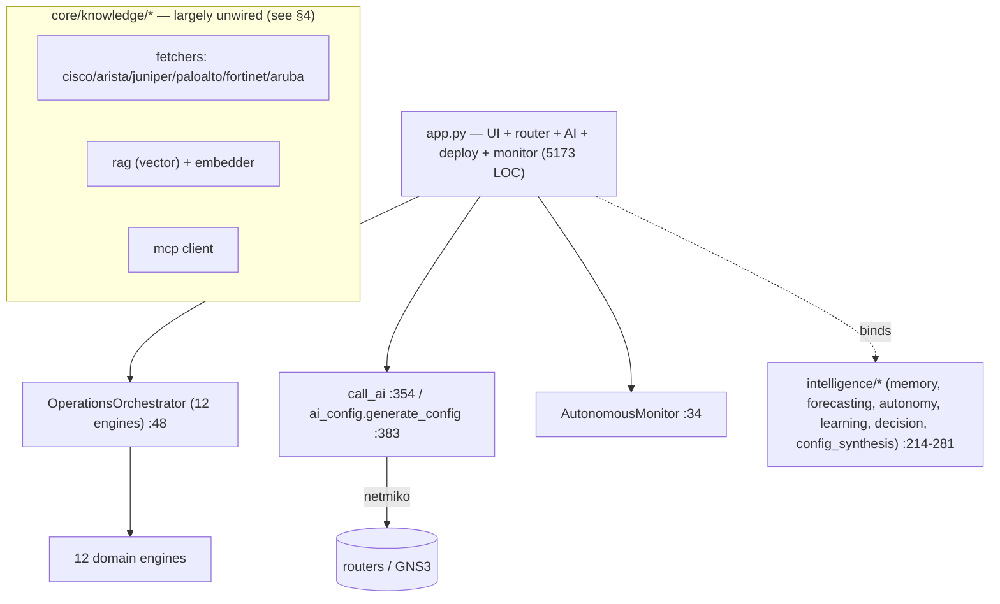

# Investigation 5 — Enterprise Architecture Assessment
### Principal Architect / CTO review of `network-intelligence-platform`

> AS-IS statements are backed by repository evidence (file:line). TO-BE statements are explicitly
> labelled **[RECOMMENDED]** and are not claims about current code. Nothing in the AS-IS sections is
> speculative; where a capability is absent it is marked **“Not found in repository.”**

---

## 1. Current AS-IS Architecture

**Shape (proven).** A single **Streamlit** process (`app.py`, **5173 LOC**) is UI, request router,
AI caller, deploy executor and monitor host at once. It builds cached singletons
(`_get_orchestrator` `app.py:453`, six `@st.cache_resource` decorators) and binds an intelligence
layer (`_bind_capabilities` `app.py:214–281`, eight `try/except`-guarded bindings). Requests are
dispatched by a flat `if/elif` on `workspace` (`app.py:990`, `1040+`).

**Composition (proven).** `OperationsOrchestrator.__init__` (`core/orchestration_engine.py:48`)
composes **twelve** engines (`nlp, rag, obs, incident, twin, comp, kg, self_heal, state, simulator,
telemetry, events`, `:52–66`) with intra-engine edges (`TelemetryEngine(simulator, state)` `:65`,
`EventEngine(state, telemetry)` `:66`).

**Code distribution (proven, `wc -l`).** `app.py` 5173, `intent_engine.py` 1190,
`device_discovery.py` 1133, `autonomous_monitor.py` 1063, `orchestration_engine.py` 981,
`event_engine.py` 719, `telemetry_engine.py` 643 — ~16.1k LOC total in `app.py + core/*.py`.

**Stack (proven, `requirements.txt`).** streamlit, sqlalchemy, netmiko, paramiko, ntc-templates,
openai, sentence-transformers, chromadb, networkx, pydantic, psycopg2-binary, bcrypt, cryptography.



---

## 2. Strengths (each evidenced)

- **Clear extensibility seams via registries.** `CapabilityRegistry` (`capability_model.py:74`),
  `ReasoningRegistry` (`reasoning.py:176`), `ForecastRegistry`, `TemplateRegistry`
  (`config_synthesis/templates.py`), `DecisionFacultyRegistry`. New units register without editing
  callers.
- **A typed reasoning model.** `EpistemicType` (`reasoning.py:36`: DETERMINISTIC/PROBABILISTIC/
  GRAPH/ML/LLM/HYBRID) and `Conclusion`/`Evidence` (`:54/:46`) give reasoning explicit provenance.
- **Deterministic configuration path exists.** `config_synthesis` compiles DNS/NTP/clock from
  templates and short-circuits the LLM (`ai_config.py:423–448`) — a real source-of-truth seam.
- **Honest verification primitive.** `OutcomeContractEngine.enforce` (`outcome_contract.py:224`)
  checks real device output and separates applied/persisted/operational.
- **Pluggable memory backend.** `_Backend` supports SQLite **and** Postgres via `NETBRAIN_MEMORY_DSN`
  (`operational_memory.py:87–106,163`).
- **Concurrency in discovery.** `ThreadPoolExecutor` for neighbor discovery
  (`topology/topology_engine.py:67`, 120 s timeout).
- **Approval-gated change by default.** Two-stage admin apply (`app.py:1952/2059`) and monitor
  `pending_approvals`/`approved_run_ids` (`autonomous_monitor.py:74/77`).

---

## 3. Weaknesses (each evidenced)

- **`app.py` is a 5173-line monolith** mixing UI, routing, AI calls, deployment and monitoring —
  low cohesion at the top layer (`wc -l app.py`).
- **God-object orchestrator.** Twelve engines composed in one constructor
  (`orchestration_engine.py:52–66`); every domain couples through it.
- **Two LLM client implementations.** `app.py:call_ai` (`:354`) and `core/ai_engine.py:ask_ai`
  (`:67`) duplicate the Groq/OpenAI call with **different system prompts** (`ai_config.py:187`,
  `ai_engine.py:74`, `app.py:367`).
- **Two RAG engines, fragmented.** Keyword `core/rag_engine.py` (wired into the orchestrator,
  `orchestration_engine.py:18/53`) vs vector `core/knowledge/rag/` (used only by memory/capability
  probes, `operational_memory.py:204`, `memory/store.py:73`, `capability_model.py:132`).
- **Defined-but-unwired control gates.** `authorize_change` (`orchestration_engine.py:812`),
  `deliberate` (`:838`) and `simulate_change_impact` (`:674`) have **no callers** in the deploy/fix
  path (Investigation 4). Capability exists; governance does not execute.
- **No platform user authentication.** No login wall / RBAC found in `app.py` (the `login` hits are
  device SSH, not user auth) → **Not found in repository.** (bcrypt/cryptography are in
  `requirements.txt` but no app-auth use was found.)
- **Vendor-coupled command generation.** Templates implement **Cisco IOS only**
  (`config_synthesis/templates.py`); synthesis defaults `Vendor.CISCO_IOS` (`synthesizer.py:87`).
- **Config risk is asserted, not computed.** `out["risk"]=data.get("risk")` (`ai_config.py:486`).
- **Minimal tests.** Only `test_orchestration.py`, `test_router.py`, `core/Local_ssh_test.py` for
  ~16k LOC; no CI configuration file found → **Not found in repository.**

---

## 4. Technical Debt (each evidenced)

- **Duplicate/legacy modules.** `core/digit_twin_engine.py` **and** `core/digital_twin_engine.py`;
  `core/inccident_engine.py` **and** `core/incident_engine.py`. The orchestrator imports the
  correctly-spelled ones (`orchestration_engine.py:13`), leaving the misspelled twins as dead/parallel
  code.
- **Large dormant subsystem.** `core/knowledge/` contains vendor **fetchers for six vendors**
  (cisco/arista/juniper/paloalto/fortinet/aruba), an **MCP client** (`knowledge/mcp/`), a **vector
  RAG** and **cache/citation** modules. Outside the package, the only runtime imports are
  `enterprise.bind_knowledge_capability` (`app.py:221`), `core.knowledge` in `intent_engine.py:50`,
  and the embedder/rag used by memory/capability probes. **No runtime import of
  `core.knowledge.fetchers` or `core.knowledge.mcp` outside the package was found** → built, not
  integrated.
- **Declared-but-divergent dependencies.** `chromadb`/`sentence-transformers` are required, but the
  orchestrator’s live RAG is keyword-based (`rag_engine.py:35`); the vector path is partial.
- **24 lazy `core.*` imports inside `app.py` functions** (Investigation 1) — hidden coupling that
  evades the module header and static analysis.
- **Two parallel command-validation gates.** `validate_config` (`ai_config.py:112`) in the admin
  path vs `CommandValidator` (`command_validator.py`) only in the intent path
  (`intent_engine.py:1043/1074`).

---

## 5. Architectural Bottlenecks (each evidenced)

- **Single-process execution model.** Streamlit re-runs `app.py` per interaction; deploy via
  `netmiko.ConnectHandler.send_config_set` (`app.py:2500`) executes **synchronously inside the UI
  process** — no job queue/worker. Long device I/O blocks the session.
- **Orchestrator as the only composition point** (`orchestration_engine.py:48`) — all engine wiring
  flows through one constructor; a change to one engine’s signature ripples here.
- **Global singletons / cached resources.** Six `@st.cache_resource` in `app.py` plus module-level
  `_engine` singletons (`get_config_intelligence`, `get_operational_memory`, etc.) — process-local
  state that does not survive horizontal scaling.
- **SQLite default for the shared brain** (`operational_memory.py:106`) — fine single-node, a
  contention point under concurrency unless `NETBRAIN_MEMORY_DSN` points at Postgres.

---

## 6. Missing Enterprise Components (**[RECOMMENDED]**, each absent in repo)

The following were searched for and are **Not found in repository**:
- **AuthN/AuthZ + RBAC** on the platform UI/API.
- **Service/API layer** (the system is UI-only; no REST/gRPC surface found).
- **Asynchronous job queue / workers** for discovery and deployment.
- **Centralized secrets manager** (current: `st.secrets`/`.env` 3-tier, `ai_engine.py:18`).
- **CI/CD pipeline and meaningful test coverage** (3 test files; no CI file).
- **Platform self-observability** (metrics/tracing/log aggregation/APM) for the app itself.
- **Multi-tenancy / org isolation** in state and memory.
- **A network source-of-truth datastore** (device facts are fetched live; no NetBox-style inventory
  DB of record was found).

---

## 7. Target TO-BE Architecture **[RECOMMENDED]**

> Recommendation only — not present in the repository today.

```mermaid
flowchart TB
    subgraph EDGE[Presentation]
      WEB[Web UI] ; APIC[API Gateway + AuthN/AuthZ/RBAC]
    end
    EDGE --> SVC[Application Services (stateless)]
    SVC --> BUS[(Async job queue / workers)]
    BUS --> EXEC[Deploy/Discovery workers — netmiko/ssh]
    SVC --> ORCHL[Orchestration service]
    ORCHL --> ENGS[Domain engines (unchanged interfaces)]
    SVC --> INTEL[Intelligence services: reasoning / decision / forecasting / learning]
    INTEL --> GATE[Active governance gate: authorize + deliberate + simulate BEFORE deploy]
    GATE --> EXEC
    SVC --> KNOW[Unified knowledge service: one RAG + vendor fetchers + citations]
    SVC --> SOT[(Network source-of-truth DB)]
    INTEL --> MEM[(Postgres brain — memory/learning/forecasts)]
    SVC --> OBS[Platform observability: metrics/traces/logs]
```

Key TO-BE moves (all recommendations):
1. **Decompose `app.py`** into UI ↔ application-service ↔ orchestration boundaries; the UI calls a
   service API, not engines directly.
2. **Make the governance gate real** — call the already-built `authorize_change` / `deliberate` /
   simulation **before** `send_config_set` (today they are defined but uncalled).
3. **Unify the two RAG engines and two LLM clients** behind one interface.
4. **Move deploy/discovery to async workers**; the UI becomes non-blocking.
5. **Add AuthN/AuthZ/RBAC and an API layer**; default the brain to Postgres.
6. **Either integrate or remove** the dormant `core/knowledge` fetchers/MCP.

---

## 8. Prioritized Refactoring Roadmap **[RECOMMENDED]**
### (Stability before features — explicitly ordered)

**Phase 0 — Stabilize (no new features).**
1. Delete/merge duplicate modules (`digit_twin_engine.py`, `inccident_engine.py`) — evidence
   `ls core/*.py`. *(Stability, low risk.)*
2. Add a regression test harness around `generate_config`, `OutcomeContractEngine.enforce`, and the
   `config_synthesis` path (currently 3 tests for 16k LOC).
3. Consolidate the two LLM clients (`call_ai`/`ask_ai`) and the four system prompts into one module.

**Phase 1 — Decouple.**
4. Extract deploy + monitor out of `app.py` into a service module behind a function API; UI calls it.
5. Replace the 24 lazy `core.*` imports in `app.py` with explicit module boundaries.
6. Unify RAG (`core/rag_engine.py` vs `core/knowledge/rag/`) behind one interface.

**Phase 2 — Govern.**
7. Wire the existing `authorize_change` / `deliberate` / simulation gates into the deploy path
   (they exist but are uncalled — Investigation 4).
8. Replace LLM-asserted `risk` (`ai_config.py:486`) with a computed score from forecasting/decision.

**Phase 3 — Enterprise hardening.**
9. AuthN/AuthZ/RBAC + API layer; default memory to Postgres.
10. Async job queue for deploy/discovery; platform observability.

**Phase 4 — Scale features (only after Phases 0–3).**
11. Vendor expansion (wire the dormant fetchers; add non-Cisco templates).

---

## 9. Quick Wins (High Impact, Low Effort) **[RECOMMENDED]**

- **Remove the two duplicate modules** (`digit_twin_engine.py`, `inccident_engine.py`) — dead
  parallel code, zero feature impact.
- **Collapse `call_ai`/`ask_ai`** into one client + one system prompt — removes prompt drift across
  `ai_config.py:187` / `ai_engine.py:74` / `app.py:367`.
- **Wire `CommandValidator` into the admin deploy path** — it already exists
  (`command_validator.py:124`) and is used only in the intent path today.
- **Compute config `risk`** from the existing forecasting/decision engines instead of trusting the
  model’s string (`ai_config.py:486`).
- **Decide the fate of `chromadb`/`sentence-transformers`** — either route live RAG through the
  vector engine or drop the dependency to match the keyword reality.

---

## 10. Long-Term Strategic Improvements **[RECOMMENDED]**

- **Service decomposition**: separate UI, orchestration, intelligence, and execution into
  independently deployable units with explicit contracts (today all are in one process).
- **Active, evidence-gated autonomy**: route every change through `authorize → deliberate →
  simulate → deploy → verify`, closing the gap where the gates exist but are not called.
- **Unified knowledge platform**: integrate the multi-vendor fetchers + MCP + citation tracking that
  already exist under `core/knowledge/`, behind one retrieval/grounding contract, and use it to
  ground configuration (today `build_prompt` is not RAG-grounded — Investigation 2).
- **True vendor independence**: generalize `config_synthesis` templates and discovery beyond Cisco
  IOS using the existing `Vendor` enum and the dormant fetchers.
- **Stateless, horizontally scalable runtime** with an external source-of-truth datastore and the
  Postgres brain as the system of record.

---

## Evaluation scorecard (AS-IS, evidence-anchored)

| Dimension | AS-IS finding | Evidence |
|---|---|---|
| Architecture quality | Layered intent, but top layer is a monolith | `app.py` 5173 LOC |
| Module boundaries | Good in `core/` subpackages; broken by duplicates | `ls core/*.py` |
| Layer separation | UI/logic/execution co-located in `app.py` | `app.py:2500` deploy in UI |
| Dependency direction | Mostly downward; leaked by 24 lazy imports | Investigation 1 |
| Coupling | High via god-object + monolith | `orchestration_engine.py:48` |
| Cohesion | Per-engine good; `app.py` low | `wc -l` |
| Extensibility | Strong (registries) | `reasoning.py:176`, `capability_model.py:74` |
| Scalability | Single-process, singletons, SQLite default | `@st.cache_resource`×6; `operational_memory.py:106` |
| Testability | Minimal | 3 test files |
| Vendor independence | Cisco IOS only in practice | `config_synthesis/templates.py`; `synthesizer.py:87` |
| Network intelligence | CDP/LLDP + connected subnets only | Investigation 3 |
| Reasoning architecture | Typed registry; gates unwired | `reasoning.py:36`; Investigation 4 |
| AI architecture | 2 clients, 4 prompts, Groq | `app.py:354`, `ai_engine.py:67` |
| Knowledge architecture | Keyword RAG live; vector/fetchers dormant | `rag_engine.py:35`; `core/knowledge/*` |
| Deployment architecture | Synchronous netmiko from UI | `app.py:2500` |
| Security | No platform auth found | **Not found in repository** |
| Memory | SQLite default / Postgres optional | `operational_memory.py:87–106` |
| Performance | Per-rerun model; cached singletons; concurrent discovery | `topology_engine.py:67` |
| Maintainability | Monolith + duplicates + dormant code | §3/§4 |
| Future readiness | Strong seams, unrealized governance | §3/§4/§10 |

---

## Honesty ledger (explicitly NOT proven)

- Platform AuthN/AuthZ, API layer, job queue, CI, multi-tenancy, self-observability →
  **Not found in repository.**
- The internal completeness of `core/knowledge/` fetchers/MCP (whether functional) was **not
  executed/verified**; only their import-wiring was checked.
- All Phase/TO-BE items in §6–§10 are **[RECOMMENDED]** and describe future architecture, not current
  code.
- Test *coverage* was not measured; only test-file presence (3 files) was confirmed.
